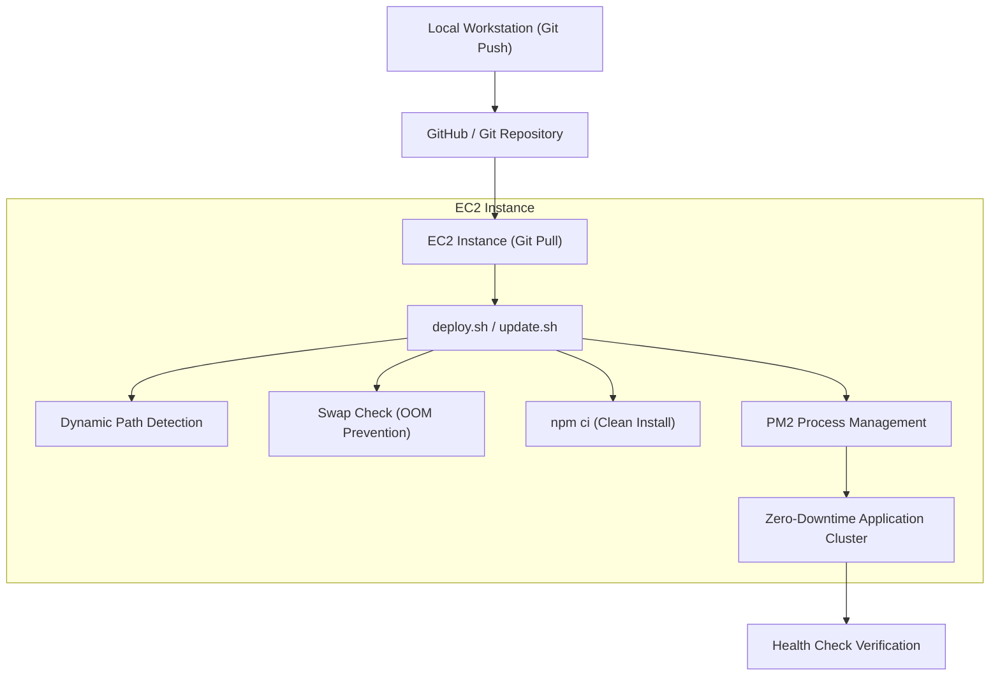

# AWS EC2 Node.js Deployment Playbook
A production-ready, reusable framework for deploying and updating Node.js applications on AWS EC2 instances using PM2 and Docker.

---

## 1. System Architecture & Flow

This playbook outlines a standard deployment architecture that automatically adapts to the target system resources (OOM prevention) and directory configurations.



---

## 2. Key Components of the Reusable Framework

The framework consists of three scripts and one configuration file that can be copied into any Node.js project:

| File | Purpose | Key Feature |
| :--- | :--- | :--- |
| `deploy.sh` | Performs initial EC2 setup and software installs | Auto-creates swap space; auto-detects OS package manager (apt/yum); runs dynamically in any folder. |
| `update.sh` | Pulls latest updates from Git and updates the app | Zero-downtime PM2 reloads; dynamic health checks. |
| `check-system.sh` | Audits system specs, memory, and package manager | Prints OS version, RAM status, swap details, and Node.js/PM2 presence. |
| `ecosystem.config.js` | Configures PM2 process management | Runs in cluster mode, redirecting logs, auto-restarting, and defining environment scopes. |

---

## 3. Playbook Configurations

Both `deploy.sh` and `update.sh` contain a configuration block at the top. Modify these variables to adapt the scripts to any new project:

```bash
# ==============================================================================
# CONFIGURATION
# ==============================================================================
NODE_VERSION="20"                  # Target Node.js major version (e.g., 20, 22)
PORT="3000"                        # Application port for health checks
HEALTH_PATH="/health"              # Health check endpoint path
PM2_CONFIG="ecosystem.config.js"   # PM2 configuration file name
PM2_ENV="production"               # PM2 environment name (production/development)
# ==============================================================================
```

---

## 4. Production Engineering Best Practices

### A. Memory Constraint Auto-Allocation (OOM Prevention)
Low-cost cloud instances (e.g., AWS `t2.micro` or `t2.nano` with 1GB or 512MB RAM) often crash during package decompression or npm builds, throwing a `dpkg-deb decompress killed` or `npm ERR! Killed` error.
> [!IMPORTANT]
> To prevent Out-Of-Memory (OOM) crashes, the `deploy.sh` script automatically checks if total memory is `< 1.5 GB` and swap space is `< 512 MB`. If so, it dynamically provisions and activates a `1 GB` temporary `/swapfile`. 

### B. Dynamic Directory Portability
Hardcoding directory paths (e.g., `/home/ubuntu/my-app`) breaks deployments if the Git repository is renamed or cloned by a different SSH user.
> [!TIP]
> The scripts dynamically detect their absolute directory at execution time using:
> `PROJECT_DIR="$(cd "$(dirname "${BASH_SOURCE[0]}")" && pwd)"`
> This makes the deployment portable to any user home directory or path.

### C. Zero-Downtime PM2 Cluster Reloads
Using `pm2 restart all` stops all application instances, creating a window of downtime for users.
> [!IMPORTANT]
> The `update.sh` script uses `pm2 reload` instead of `restart`. Combined with cluster mode (`instances: 'max'`), PM2 restarts instances one-by-one, keeping the application online and serving traffic during the update.

### D. Lockfile Management
The `deploy.sh` and `update.sh` scripts use `npm ci` (clean install) instead of `npm install` for deterministic dependency trees.
> [!WARNING]
> Since `npm ci` requires an existing `package-lock.json`, you must ensure `package-lock.json` is **not** ignored in `.gitignore`. Staging it in Git guarantees stable, repeatable builds on the server.

### E. PM2 Environment Scoping
To launch applications under specific environment profiles without warnings:
- Define both `env` (default/development) and `env_production` blocks in `ecosystem.config.js`.
- Always start PM2 with the `--env <profile>` flag (e.g., `--env production`) to avoid fallback warnings.

---

## 5. Quick Setup for New Projects

To use this framework in a new project:

1. **Copy Files**: Copy `deploy.sh`, `update.sh`, `check-system.sh`, and `ecosystem.config.js` to the root of your new project.
2. **Configure Variables**: Open `deploy.sh` and `update.sh` and edit the `CONFIGURATION` block variables (Node version, port, health check path).
3. **Configure PM2**: Edit the `name` and `script` properties in `ecosystem.config.js` to match your new application.
4. **Git Setup**: Ensure `package-lock.json` is committed and not in `.gitignore`.
5. **Security Groups**: Open your application port (e.g., `3000`) in the AWS EC2 Security Groups.
6. **Execute**: SSH into the EC2 instance, clone the project, and run:
   ```bash
   bash deploy.sh
   ```
